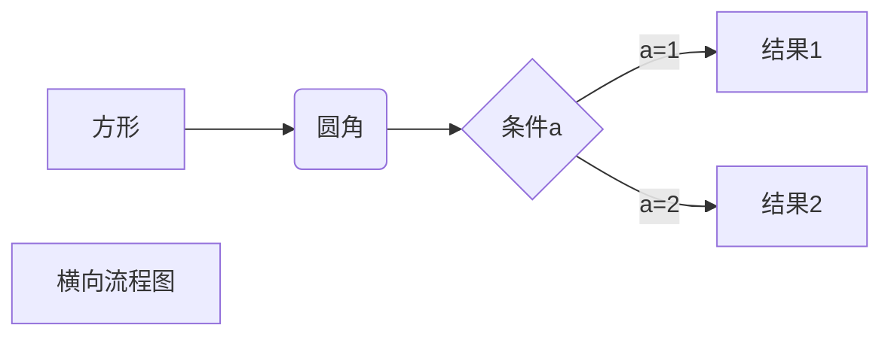

## md文件的使用（markdown的基本使用）

###  标题
```
    #一级标题 
    ##二级标题
    ###....类似
```
### 列表
```
    -/+/*  后面空格 之后展示无序列表；
    输入数字加.  加空格 展示有序列表 
    列表可以嵌套，利用tab或者空格缩进

```

### 区块

```
    利用“>”+空格 可以表是引用区块，利用多个">"符号可以完成嵌套，与#相似；

    '``` ```'符号可以表示代码块，用"` `",单个表示单行，用三个表示多行，有开有闭；

```

### 链接
```
    链接可以使用两种方式：
    1. [链接标题](链接 title)
    2. [链接标题]:链接 title
```

### 图片
```
    图片与链接相同 ,开头多了个！
    1. ！[图片标题](地址或链接 title)
    2. ！[图片标题]：地址或链接 title


```

### 分割线

```
    分割线可以由* - _（星号，减号，底线）这3个符号的至少3个符号表示，注意至少要3个，且不需要连续，有空格也可以
```
### 可以使用一些html标签
```
    例如加粗斜体 <b><u><i><br>等；还有转义字符；
```

### 表格
|123|234|345|
|:-|:-:|-:|
|abc|bcd|cde|
|abc|bcd|cde|
|abc|bcd|cde|
//例子二
|123|234|345|
|:---|:---:|---:|
|abc|bcd|cde|
|abc|bcd|cde|
|abc|bcd|cde|
//例子三
123|234|345
:-|:-:|-:
abc|bcd|cde
abc|bcd|cde

### 流程图
```flow
    st=>start: 开始框
    op=>operation: 处理框
    cond=>condition: 判断框(是或否?)
    sub1=>subroutine: 子流程
    io=>inputoutput: 输入输出框
    e=>end: 结束框
    st->op->cond
    cond(yes)->io->e
    cond(no)->sub1(right)->op
```



